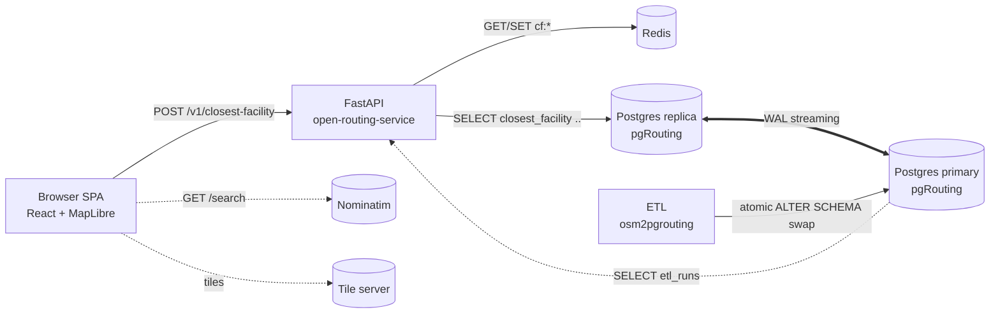

<div align="center">

# open-network-solver

**Open-source closest-facility routing over OpenStreetMap.**

OSM &nbsp;→&nbsp; PostGIS + pgRouting &nbsp;→&nbsp; FastAPI &nbsp;→&nbsp; React + MapLibre

[](LICENSE)
[](https://www.python.org/)
[](https://nodejs.org/)
[](https://docs.docker.com/compose/)
[](#contributing)

</div>

---

## What is it?

`open-network-solver` answers a single question, fast:

> **"Given an incident at this lat/lon, what are the K nearest facilities
> (fire stations, hospitals, police, EMS, …) by road network distance or
> travel time, with the actual route geometry to draw on a map?"**

It is a complete, self-contained stack:

- A **Postgres + pgRouting** topology built from an OpenStreetMap PBF.
- A **FastAPI** service exposing one HTTP endpoint, backed by a streaming
  read-replica and a Redis cache.
- A **React 19 + MapLibre GL JS** single-page app for interactive use.
- A monthly **ETL** that rebuilds the routing graph atomically (staging-then-swap, no stale-cache window).

It is designed for **emergency-services dispatch**, **logistics planning**,
**field-service routing**, and any other "what's the nearest unit?" workflow.

---

## Why this stack?

| Choice | Reason |
|--------|--------|
| **pgRouting + PostGIS** | Filter facilities by SQL attributes (`amenity=fire_station`, etc.) without baking POI catalogs into the graph. |
| **Read replica for routing reads** | Writes (ETL, migrations) never block routing. |
| **Redis cache, best-effort** | Outages degrade latency — never correctness. |
| **Browser-direct Nominatim** | Address-search outages cannot take down the routing API. |
| **Staging-then-swap ETL** | Eliminates the half-rebuilt-topology and stale-cache windows that haunt in-place updates. |
| **HTTP/REST only in v1** | Browsers are the only first-party client; MCP / gRPC are explicit non-goals. |

See [`docs/architecture.md`](docs/architecture.md) for the full architecture brief.

---

## Architecture at a glance



| Component | Tech | Folder |
|-----------|------|--------|
| Routing API | FastAPI · SQLAlchemy 2.x async · asyncpg · redis-py · Prometheus | [`open-routing-service/`](open-routing-service/) |
| Web UI | React 19 · Vite 6 · TypeScript 5.7 · Tailwind v4 · Zustand · MapLibre GL JS | [`open-routing-service-ui/`](open-routing-service-ui/) |
| Routing DB | Postgres 16 · PostGIS 3.6 · pgRouting 3.7 (primary + streaming replica) | [`infra/`](infra/) |
| ETL | osmconvert · osm2pgrouting · osmium · Python | [`infra/etl/`](infra/etl/) |
| Geocoder | Nominatim 4.5 (called direct from the browser) | [`infra/`](infra/) |
| Observability | Prometheus · Grafana | [`infra/`](infra/) |

---

## Quick start

```sh
# 1. Clone and configure
git clone https://github.com/rrajaramengg-spec/open-network-solver.git
cd open-network-solver
cp infra/.env.example infra/.env
#  → set POSTGRES_PASSWORD, NOMINATIM_PASSWORD, GRAFANA_PASSWORD

# 2. Drop a small OSM extract into the data volume (one-time)
#    e.g. https://download.geofabrik.de/north-america/us/nevada-latest.osm.pbf
#    See docs/runbooks/local-operations.md §2 for the copy snippet.

# 3. Run the ETL once
docker compose --env-file infra/.env -f infra/docker-compose.yml \
  --profile etl run --rm etl --pbf /data/osm/nevada-latest.osm.pbf

# 4. Boot the full service stack
docker compose --env-file infra/.env -f infra/docker-compose.yml \
  --profile service up -d
```

Smoke test:

```sh
curl -s http://localhost:58000/readyz | jq
curl -s -X POST http://localhost:58000/v1/closest-facility \
  -H "Content-Type: application/json" \
  -d '{"incident":{"lat":36.17,"lon":-115.14},"k":3,"facility_filter":{"amenity":"fire_station"}}' | jq
```

| What | Where |
|------|-------|
| Web UI | http://localhost:58081 |
| Routing API | http://localhost:58000 |
| Swagger UI | http://localhost:58000/docs |
| Grafana | http://localhost:53000 *(with `--profile observability`)* |

**Full operating instructions — services, credentials, all Docker commands,
URLs, endpoints, troubleshooting — live in
[`docs/runbooks/local-operations.md`](docs/runbooks/local-operations.md).**

---

## API at a glance

`POST /v1/closest-facility`

```json
{
  "incident":        { "lat": 36.17, "lon": -115.14 },
  "buffer_m":        500,
  "k":               3,
  "cost_mode":       "distance",
  "facility_filter": { "amenity": "fire_station" }
}
```

Returns the top-K facilities ranked by route cost, each with route geometry
(GeoJSON `LineString`), total cost, and the matched facility's tags.

| Method | Path | Purpose |
|--------|------|---------|
| `POST` | `/v1/closest-facility` | Top-K nearest facilities + routes |
| `GET`  | `/healthz` | Liveness |
| `GET`  | `/readyz` | Readiness (primary + replica + Redis) |
| `GET`  | `/v1/etl-status` | Latest ETL run metadata |
| `GET`  | `/metrics` | Prometheus exposition |
| `GET`  | `/docs`, `/redoc`, `/openapi.json` | Interactive API docs |

---

## Repository layout

```
open-network-solver/
├── open-routing-service/        # FastAPI backend (Python 3.12+)
├── open-routing-service-ui/     # React 19 + Vite SPA
├── infra/                       # docker-compose, Prometheus, Grafana, ETL
├── docs/
│   ├── architecture.md          # C4 + sequence + ER diagrams
│   └── runbooks/
│       └── local-operations.md  # Run-it-yourself guide
├── LICENSE
└── README.md
```

---

## Development

### Backend

```sh
cd open-routing-service
python -m venv .venv && . .venv/Scripts/Activate.ps1   # PowerShell
pip install -e ".[dev]"
pytest tests/unit/                 # fast unit tests
pytest tests/integration/ -m e2e   # testcontainers — needs Docker
```

### Frontend

```sh
cd open-routing-service-ui
cp .env.example .env
npm ci
npm run dev          # http://localhost:5173
npm test             # Vitest
npm run test:e2e     # Playwright
```

Per-app details: [`open-routing-service/README.md`](open-routing-service/README.md)
· [`open-routing-service-ui/README.md`](open-routing-service-ui/README.md).

---

## Performance

| Scenario | p95 latency target | Throughput |
|----------|-------------------:|-----------:|
| Cached response (Redis hit) | < 200 ms | tested at 100 RPS |
| Uncached response (replica hit) | < 800 ms | tested at 100 RPS |
| Sustained mixed load | — | tested at 500 RPS |

Reproduce with the included [k6](https://k6.io/) script:

```sh
k6 run open-routing-service/tests/load/closest_facility.k6.js
```

---

## Configuration

All runtime configuration is via environment variables. The most important
ones:

| Variable | Default | Purpose |
|----------|---------|---------|
| `POSTGRES_PASSWORD` | _(required)_ | Postgres routing user |
| `NOMINATIM_PASSWORD` | _(required)_ | Nominatim user |
| `GRAFANA_PASSWORD` | `admin` | Grafana admin |
| `CORS_ALLOW_ORIGINS` | `http://localhost:58081` | Comma-separated allow-list |
| `RATE_LIMIT_PER_MINUTE` | `60` | Per-IP routing quota |
| `CACHE_TTL_SECONDS` | `3600` | Redis cache TTL |
| `SHUTDOWN_GRACE_S` | `30` | SIGTERM drain window |

Sub-app variables: [`open-routing-service/README.md` §Environment variables](open-routing-service/README.md)
· [`open-routing-service-ui/README.md` §Environment variables](open-routing-service-ui/README.md).

---

## Roadmap

- ✅ v1 — closest-facility over distance and travel-time, top-K, K∈[1,10].
- ⏳ Vector basemap tiles built from the same PBF.
- ⏳ Postgres HA via Patroni / repmgr in compose.
- ⏳ MCP server exposing the same `ClosestFacilityService` as a tool.
- ⏳ Multi-modal routing (foot, bike).
- ⏳ Time-of-day-aware costs (historical traffic).

---

## Contributing

Contributions are welcome. Please:

1. Open an issue describing the change before sending a PR.
2. Match the existing code style (`ruff` + `mypy --strict` on Python,
   `eslint` + `tsc --noEmit` on TypeScript).
3. Add tests for every new public function or endpoint.
4. Keep PRs surgical — one logical change per PR.

See [`docs/runbooks/local-operations.md`](docs/runbooks/local-operations.md)
for the local development environment.

---

## License

[MIT](LICENSE) © open-network-solver contributors.

---

## Acknowledgements

This project stands on the shoulders of:

- [OpenStreetMap](https://www.openstreetmap.org/) contributors.
- [pgRouting](https://pgrouting.org/) and [PostGIS](https://postgis.net/).
- [OSRM](https://github.com/Project-OSRM/osrm-backend) and
  [Valhalla](https://github.com/valhalla/valhalla) — as design references
  for the "preprocess once, serve fast" pattern.
- [Nominatim](https://nominatim.org/), [MapLibre](https://maplibre.org/),
  [FastAPI](https://fastapi.tiangolo.com/), and the broader open-geo
  ecosystem.
