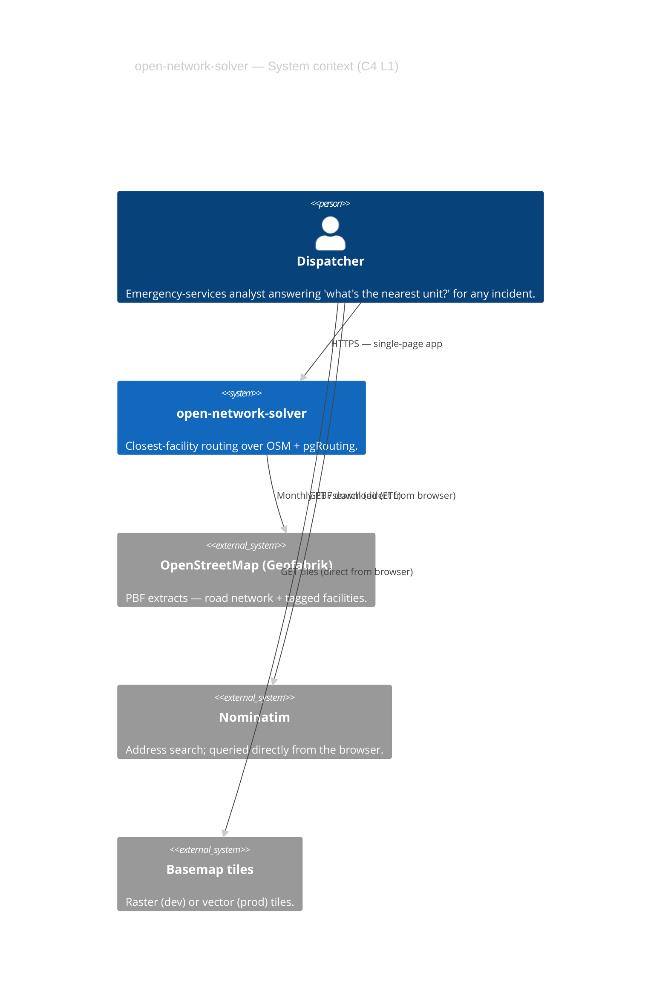
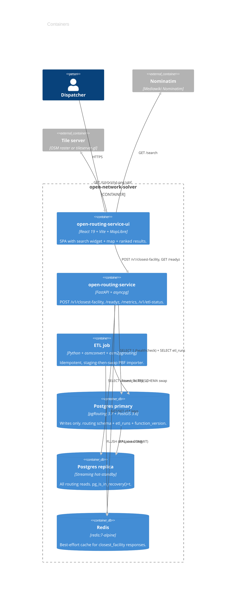
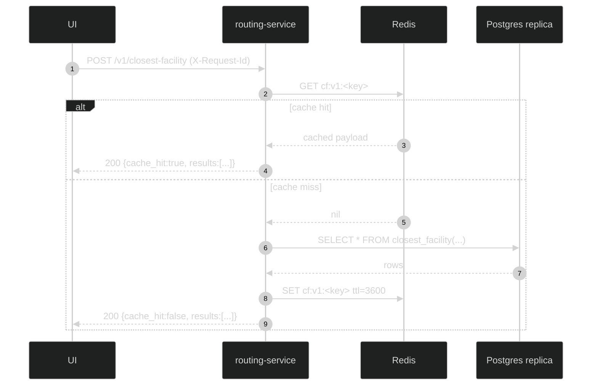
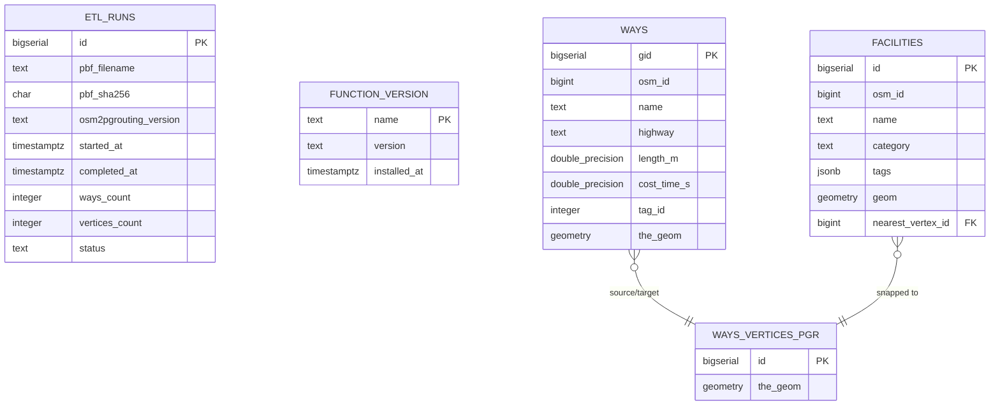

# Architecture brief — open-network-solver (v1)

> Consolidated architecture brief for the closest-facility routing stack.
> Applies the `architecture-brief` skill (C4 + sequence + ER).
>
> Read alongside [`openspec/changes/closest-facility-routing-service/design.md`](../openspec/changes/closest-facility-routing-service/design.md).

---

## 1. Context



The dispatcher uses one UI; the UI talks **direct** to Nominatim and the tile
service. The routing service handles only routing.

---

## 2. Containers (C4 L2)



### Why two apps

* The browser is the only v1 client; everything beyond is internal.
* The UI ships separately so the SPA can be re-deployed without bouncing the
  API (and vice versa).
* No MCP / FastMCP layer in v1 — a deliberate non-goal (design D5). The
  `ClosestFacilityService` is an injectable Protocol so a future MCP tool
  can call the same code without touching the HTTP layer.

---

## 3. Sequence — happy path



Error mapping:

| Cause | Status | `error_code` |
|-------|-------:|--------------|
| Pydantic invalid | 422 | `invalid_request` |
| `incident_off_graph` from PL/pgSQL | 422 | `incident_off_graph` |
| SlowAPI quota | 429 | `rate_limited` |
| Replica pool exhausted / unreachable | 503 | `routing_db_unavailable` |
| `asyncio.timeout` fires (>5 s default) | 504 | `routing_timeout` |

---

## 4. Sequence — ETL atomic swap

```mermaid
%%{init: {'theme':'dark'}}%%
sequenceDiagram
    autonumber
    participant ETL
    participant PG as Postgres primary
    participant R as Redis
    ETL->>ETL: sha256(PBF)
    ETL->>PG: INSERT etl_runs (status=running)
    ETL->>ETL: osmconvert reduce → tmp.osm
    ETL->>PG: osm2pgrouting --schema routing_next
    ETL->>PG: COPY facilities (extracted via osmium)
    ETL->>PG: BEGIN; DROP routing_prev; \nALTER SCHEMA routing -> routing_prev; \nALTER SCHEMA routing_next -> routing; \nCOMMIT;
    ETL->>R: SCAN MATCH cf:* | DEL  (post-COMMIT)
    ETL->>PG: UPDATE etl_runs (status=success)
```

Failure of any pre-swap step leaves `routing_next` orphaned but the live
`routing` schema untouched — see [`docs/runbooks/etl-runbook.md`](runbooks/etl-runbook.md).

---

## 5. Data model (ER)



The `closest_facility(geom, buffer_m, jsonb_filter, k, mode)` PL/pgSQL
function runs entirely against `ways`, `ways_vertices_pgr`, and `facilities`.

---

## 6. Non-functional posture

| Concern | Posture |
|---------|---------|
| Availability | 99.9 % single region (2+ stateless replicas behind LB; HA Postgres via Patroni). |
| Latency (p95) | 200 ms cached / 800 ms uncached at 100 RPS (Phase 3 gate); 300 ms / 1 s at 500 RPS (Phase 5 gate). |
| Durability | Postgres WAL on primary + streaming replica; ETL is fully reproducible from a PBF + sha. |
| Cache failure | Best-effort — outage degrades latency, not correctness. |
| Geocoding failure | Browser-direct (D6) — only address-search UX is affected. |
| Data freshness | Monthly PBF ETL; staleness alert at 45 days. |
| Observability | JSON logs with request_id, Prometheus metrics, Grafana dashboard, /readyz contract. |
| Security | Non-root containers, no secrets in git, CORS allow-list per env, SlowAPI per-IP rate-limit, `pip-audit` + `npm audit` in CI. |

---

## 7. Tech stack rationale

| Choice | Why | Alt rejected because |
|--------|-----|----------------------|
| pgRouting + PostGIS | Routing + facility filter in one SQL function | OSRM/Valhalla don't support arbitrary attribute filters cheaply |
| FastAPI + uvicorn | Async-native, OpenAPI built-in, Pydantic v2 | Flask + sync workers cost more pods per RPS |
| MapLibre GL JS (no react-map-gl) | One less abstraction, full control of layer ordering | `react-map-gl` shifts API across majors; we keep MapLibre raw |
| Zustand | Minimal, no boilerplate, no Provider tree | Redux ToolKit overkill for a single search-flow store |
| Tailwind v4 + CSS variables for tokens | CSS-first config, no JS theme bridge | Styled-components adds runtime overhead |
| Staging-then-swap ETL | Atomic, no stale-cache window | In-place updates require complex invalidation |
| Browser-direct Nominatim | Routing stays UP if Nominatim is down | Proxying through the API couples two failure modes |
| No MCP in v1 | Browser is the only client | MCP adds surface area with no near-term consumer |

---

## 8. Phase map

| Phase | Doc | Status |
|-------|-----|--------|
| 1 — Foundation | [`phases/phase-1-foundation.md`](phases/phase-1-foundation.md) | ✅ |
| 2 — Routing core | (work landed in Phase 2 of the change) | ✅ |
| 3 — Backend service | [`phases/phase-3-service.md`](phases/phase-3-service.md) | ✅ |
| 4 — UI | [`phases/phase-4-ui.md`](phases/phase-4-ui.md) | ✅ |
| 5 — Production hardening | [`phases/phase-5-production.md`](phases/phase-5-production.md) | ✅ |

---

## 9. Cross-cutting reading

* [`openspec/changes/closest-facility-routing-service/design.md`](../openspec/changes/closest-facility-routing-service/design.md) — design decisions D1–D16, including the staging-swap pattern, browser-direct Nominatim (D6), and the readyz contract (D16).
* [`openspec/changes/closest-facility-routing-service/specs/closest-facility/spec.md`](../openspec/changes/closest-facility-routing-service/specs/closest-facility/spec.md) — capability spec (canonical contract).
* [Runbooks](runbooks/) — operational playbooks.
